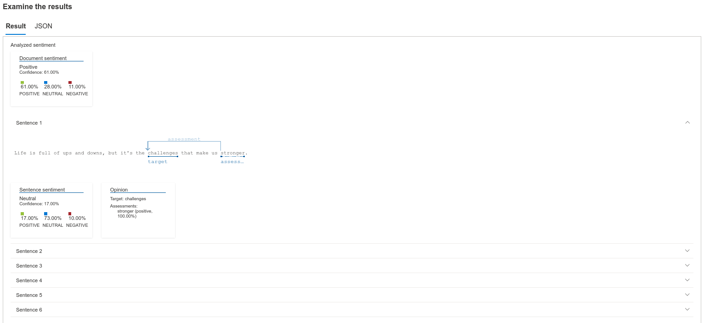
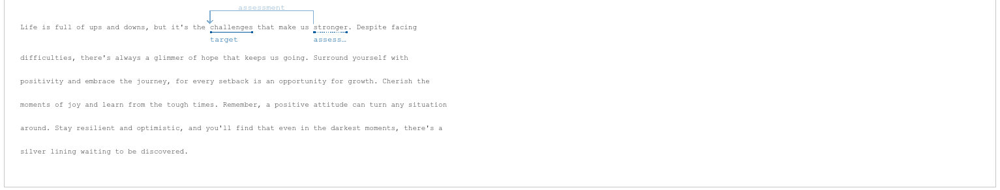

# dio-lab-azure-language-studio
Repositório do desafio DIO - Análise de Sentimentos com Language Studio no Azure AI

Neste projeto nos utilizamos um modelo de analise de sentimentos com o Azure Language Studio. O Azure Language Studio é um serviço de inteligência artificial que nos permite analisar textos em diversos idiomas para analisar o sentimento, seja ele negativo, positivo ou neutro.

## Passos para realização do desafio

- Utilizando o https://language.cognitive.azure.com/tryout/sentiment
- Escolhemos um idioma do texto que será analisado.
- Escrevemos um texto ou fazemos upload de um para ser analisado.
- O Azure nos retorna o relatório completo da análise do texto.

